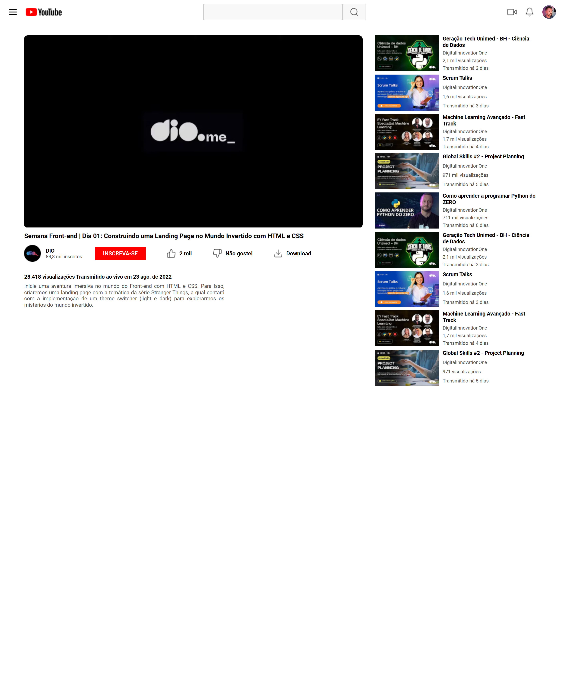

# Desafio 02: Clonando a Página do Youtube com CSS

Bem vindo(a) ao segundo desafio da Trilha de CSS da DIO! Neste Desafio você colocará a mão na massa e irá clonar a página do YouTube com CSS colocando em prática todos os conceitos aprendidos, principalmente sobre Flexbox.

[Clique aqui](https://jonathanppmaia.github.io/formacao_CSS_Dio/trilha-css-desafio-02/index.html/) para acessar o resultado final do clone da página do youtube com CSS.

[Link do Figma](https://www.figma.com/file/lrRWUZPKnqMDZrSDJmZxUS/Desafio-de-Flexbox---DIO?node-id=0%3A1) contendo o protótipo do desafio para
que você possa se basear.

\_Observações: Na aba de vídeos relacionados usei o flex-grow para lainhar os tetxos em todo o container.
